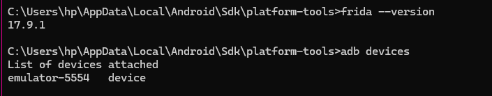
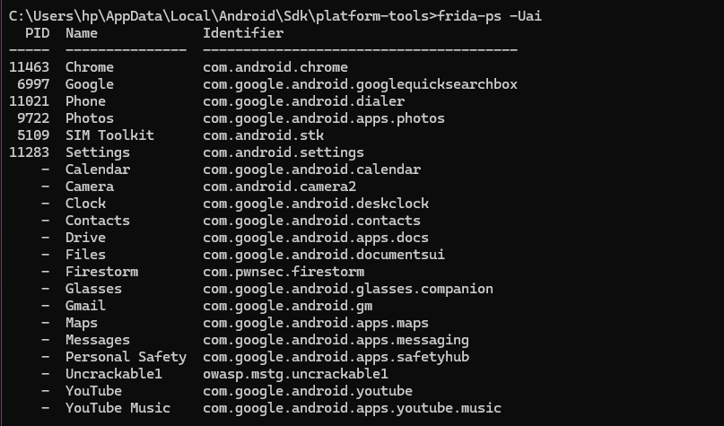
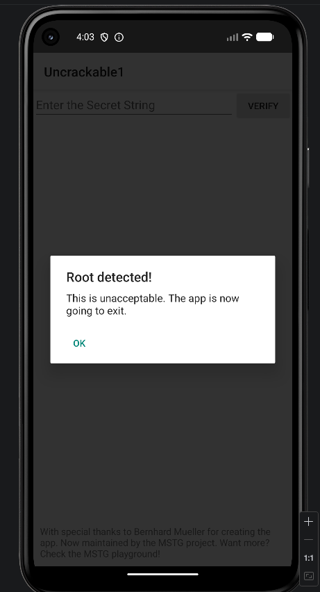
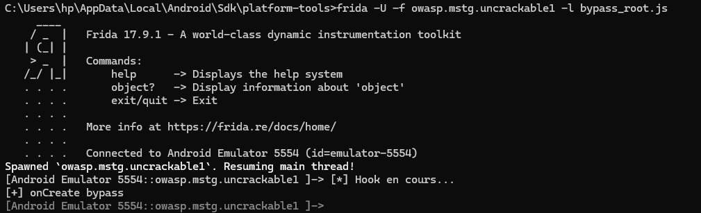
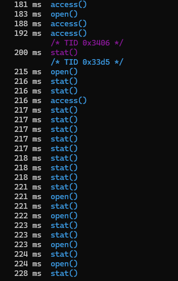
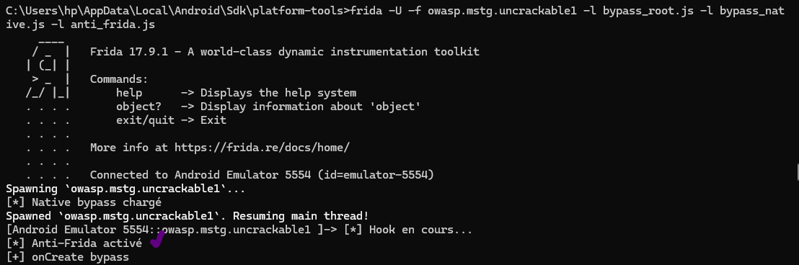

Lab Frida Root Detection Bypass
 1. Installation et vérification

Nous avons vérifié que les outils nécessaires sont installés :

Frida fonctionne correctement
Python peut importer Frida
L’appareil Android est détecté avec ADB

2. Déploiement
Nous avons listé les applications installées sur l’appareil avec Frida.
L’application cible utilisée est :
owasp.mstg.uncrackable1

3. Détection de root (avant bypass)
L’application a été lancée sans Frida.
Résultat :
L’application détecte le root
Elle affiche un message de sécurité

4. Bypass Java
Nous avons utilisé un script Frida pour :
Intercepter une fonction importante de l’application
Modifier son comportement
Empêcher le blocage de l’application
Résultat :
   L’application ne détecte plus le root
   Elle fonctionne normalement

5. Analyse native
Nous avons utilisé frida-trace pour observer les appels natifs.
Résultat :
L’application utilise des fonctions comme :open access stat
Ces fonctions servent à vérifier l’existence de fichiers
Elles peuvent être utilisées pour détecter des fichiers liés au root

 6. Anti-Frida
Nous avons utilisé un script pour :
Masquer la présence de Frida
Empêcher l’application de détecter l’outil
Cela renforce le bypass et évite les protections anti-instrumentation

